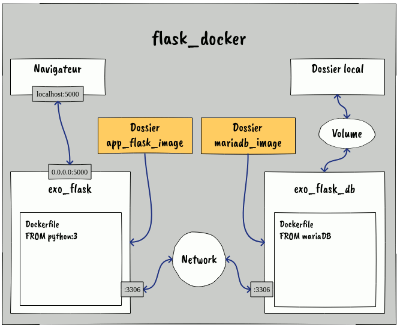

# Projet Docker

Intégration d'une application Flask en conteneurs Docker

**Pensez à dézipper ```modele.zip``` dans ```app_flask_image/app_flask/```**

## Principe

#### Création de deux images **docker**:     
- une image contenant la base de donnée **mariadb**
	- Script.sql crée une base de donnée       
- une image python éxecutant l'application Flask

#### Création d'un volume
 - qui enregistre la base en local
 
#### Création d'un réseau
 - qui relie les deux conteneurs
 
#### Démarrage du serveur
 - en liant le volume
 - en liant le réseau
 
#### Démarrage de l'appli
 - en liant le réseau
 - en exposant les ports

## Schéma


## Exécution

#### Création de l'image mariadb
```bash
$ docker build -t maria_exo_flask .
```

#### Création de l'image flask
```bash
$ docker build -t exo_flask .
```

#### Création d'un volume
```bash
$ docker volume create --name exo_flask_db
```

#### Création d'un résaux
```bash
$ docker network create --name mon_reseau
```

#### Démarrage du serveur
```bash
$ docker run --network mon_reseau -v "exo_flask_db:/var/lib/mysql" maria_exo_flask
```

#### Démarrage du site
```bash
$ docker run --network mon_reseau -p 5000:5000 exo_flask
```